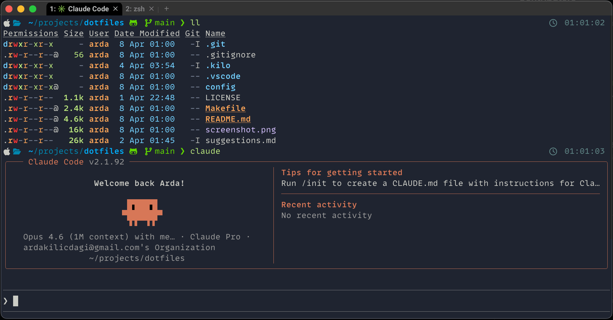
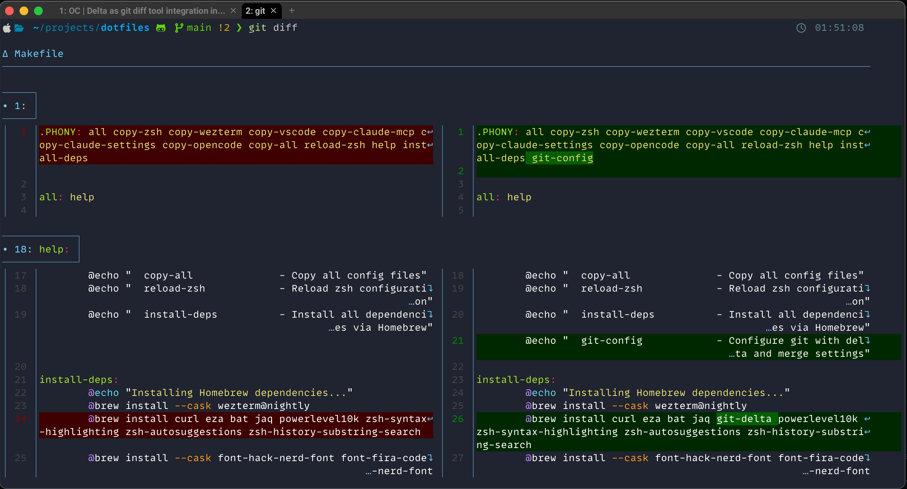

# dotfiles

Minimal dotfiles for my daily setup.

Nothing fancy, just practical improvements.

## Screenshots

### Main Screen


### Git Diff (`git diff`)


## My Environment

- macOS
- zsh
- [WezTerm](https://wezterm.org/) (nightly)
- [OpenCode](https://opencode.ai/)
- [Claude Code](https://claude.ai/)
- [VS Code](https://code.visualstudio.com/)
- [Kilo Code](https://www.kilo.ai/)

## Requirements

Install everything with one command:

```sh
make install-deps
```

Or install individually:

```sh
brew install --cask wezterm@nightly && brew install curl eza bat jaq git-delta powerlevel10k zsh-syntax-highlighting zsh-autosuggestions zsh-history-substring-search
```

### Individual tools:

- [wezterm@nightly](https://formulae.brew.sh/cask/wezterm@nightly) — GPU-accelerated terminal emulator
- [curl](https://curl.se/) — data transfer
- [eza](https://eza.rocks/) — modern `ls` replacement
- [bat](https://github.com/sharkdp/bat) — `cat` with syntax highlighting
- [jaq](https://github.com/01mf02/jaq) — Rust reimplementation of `jq`
- [git-delta](https://github.com/dandavison/delta) — syntax-highlighting pager for git

### ZSH plugins:
- [powerlevel10k](https://github.com/romkatv/powerlevel10k) — ZSH theme
- [zsh-syntax-highlighting](https://github.com/zsh-users/zsh-syntax-highlighting) — fish-like highlighting
- [zsh-autosuggestions](https://github.com/zsh-users/zsh-autosuggestions) — fish-like autosuggestions
- [zsh-history-substring-search](https://github.com/zsh-users/zsh-history-substring-search) — fuzzy history search

## Font

### Primary Font

- [MonoLisa Font](https://monolisa.dev/) (MonoLisa is a paid font)
- [MonoLisa Nerd Font patch](https://github.com/daylinmorgan/monolisa-nerdfont-patch)

Needed for icons and prompt.

### Alternative Fonts (Free)

I recommend Hack for Terminal, and FiraCode for IDEs. Nerd Font patches are required for icons and prompt on Terminal usage.

#### Install via Homebrew
```sh
brew install --cask font-hack-nerd-font
brew install --cask font-fira-code-nerd-font
```

#### Manual Download
- [Hack Nerd Font](https://github.com/ryanoasis/nerd-fonts/releases/download/latest/Hack.zip)
- [FiraCode Nerd Font](https://github.com/ryanoasis/nerd-fonts/releases/download/latest/FiraCode.zip)

---

## Setup

### Using Makefile (Recommended)

Copy all config files with one command:

```sh
make copy-all
```

Individual targets:

```sh
make copy-zsh                      # Copy config/zsh/.zshrc to ~/.zshrc
make copy-wezterm                  # Copy config/wezterm/.wezterm.lua to ~/.wezterm.lua
make copy-vscode-settings          # Copy config/vscode/settings.json to VS Code settings
make copy-vscode-insiders-settings # Copy config/vscode-insiders/settings.json to VS Code Insiders settings
make copy-kiro-desktop-settings    # Copy config/kiro-desktop/settings.json to Kiro desktop settings
make copy-kiro-desktop-agents      # Copy Kiro desktop agents to ~/.kiro/agents/
make copy-kiro-cli-agents          # Copy Kiro CLI agents to ~/.kiro/agents/
make copy-claude-mcp               # Copy config/claude-code/.claude.json to ~/.claude.json
make copy-claude-settings          # Copy config/claude-code/settings.json to ~/.claude/settings.json
make copy-claude-output-styles     # Copy output styles to ~/.claude/output-styles/
make copy-opencode                 # Copy config/opencode/opencode.json to ~/.config/opencode/opencode.json
make copy-opencode-agents          # Copy opencode agents to ~/.config/opencode/agents/
make git-config                    # Configure git with delta and merge settings
make reload-zsh                    # Reload zsh configuration
make install-deps                  # Install all dependencies via Homebrew
```

Run `make help` for all available targets.

### Manual Setup

Clone:

```sh
git clone https://github.com/Ardakilic/dotfiles ~/.dotfiles
```

Copy config:

```sh
cp ~/.dotfiles/config/zsh/.zshrc ~/.zshrc
cp ~/.dotfiles/config/wezterm/.wezterm.lua ~/.wezterm.lua
```

Copy VS Code settings:

```sh
cp ~/.dotfiles/config/vscode/settings.json "$HOME/Library/Application Support/Code/User/settings.json"
```

Copy Kiro settings:

```sh
cp ~/.dotfiles/config/kiro-desktop/settings.json "$HOME/Library/Application Support/Kiro/User/settings.json"
```

Copy Kiro desktop agents:

```sh
cp -r ~/.dotfiles/config/kiro-desktop/agents/*.md ~/.kiro/agents/
```

Copy Kiro CLI agents:

```sh
mkdir -p ~/.kiro/agents
cp -r ~/.dotfiles/config/kiro-cli/agents/*.json ~/.kiro/agents/
```

Copy Claude Code Settings:

```sh
cp ~/.dotfiles/config/claude-code/.claude.json ~/.claude.json  # MCP servers
cp ~/.dotfiles/config/claude-code/settings.json ~/.claude/settings.json
mkdir -p ~/.claude/output-styles
cp ~/.dotfiles/config/claude-code/output-styles/*.md ~/.claude/output-styles/
```

Copy OpenCode Settings:

```sh
mkdir -p ~/.config/opencode
cp ~/.dotfiles/config/opencode/opencode.json ~/.config/opencode/opencode.json
mkdir -p ~/.config/opencode/agents
cp ~/.dotfiles/config/opencode/agents/*.md ~/.config/opencode/agents/
```

Reload:

```sh
source ~/.zshrc
```

### Git Configuration

Git is configured with delta as the diff pager and zdiff3 for merge conflicts:

```sh
make git-config
```

Or manually:

```sh
git config --global core.pager delta
git config --global interactive.diffFilter "delta --color-only"
git config --global delta.navigate true
git config --global delta.dark true
git config --global delta.line-numbers true
git config --global delta.side-by-side true
git config --global merge.conflictStyle zdiff3
```

---

## Config Structure

```
config/
├── claude-code/
│   ├── .claude.json           # Claude Code MCP servers config
│   ├── settings.json          # Claude Code settings
│   └── output-styles/         # Claude Code output styles
│       ├── ask.md             # Advisory Q&A style
│       ├── architect.md       # Planning and design style
│       ├── review.md          # Code review style
│       └── debug.md           # Systematic debugging style
├── wezterm/
│   └── .wezterm.lua           # WezTerm terminal config
├── zsh/
│   └── .zshrc                 # ZSH shell config
├── vscode/
│   └── settings.json          # VS Code editor settings
├── vscode-insiders/
│   └── settings.json          # VS Code Insiders editor settings
├── kiro-desktop/
│   ├── settings.json          # Kiro desktop settings
│   └── agents/                # Kiro desktop custom agents (markdown format)
│       ├── ask.md             # Advisory Q&A agent
│       ├── architect.md       # Planning and design agent
│       ├── review.md          # Code review agent
│       └── debug.md           # Systematic debugging agent
├── kiro-cli/
│   └── agents/                # Kiro CLI custom agents (JSON format)
│       ├── ask.json           # Advisory Q&A agent
│       ├── architect.json     # Planning and design agent
│       ├── review.json        # Code review agent
│       └── debug.json         # Systematic debugging agent
└── opencode/
    ├── opencode.json          # OpenCode AI config
    └── agents/                # OpenCode custom agents
        ├── ask.md             # Advisory Q&A agent
        ├── architect.md       # Planning and design agent
        ├── review.md          # Code review agent
        └── debug.md           # Systematic debugging agent
```

---

## Notes

* Built for macOS (Homebrew paths)
* Some parts assume WezTerm (`.zshrc` conditionally loads plugins only inside WezTerm — see line 76 of `.zshrc`)
* `.wezterm.lua` includes a commented-out Ghostty alternative config at the bottom
* Not portable without tweaks

## TODOs

- [x] Add `make install-deps` target to install dependencies
- [x] Add `opencode` support
- [ ] Add `.gitconfig` support
- [ ] Add `.gitignore_global` support
