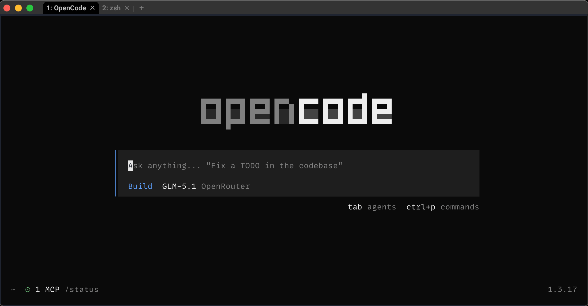

# dotfiles

Minimal dotfiles for my daily setup.

Nothing fancy, just practical improvements.



## My Environment

- macOS
- zsh
- [WezTerm](https://wezterm.org/) (nightly)
- [Claude Code](https://claude.ai/)
- [VS Code](https://code.visualstudio.com/)
- [Kilo Code](https://www.kilocode.com/)

## Requirements

Install everything with one command:

```sh
brew install --cask wezterm@nightly && brew install curl eza bat jaq powerlevel10k zsh-syntax-highlighting zsh-autosuggestions zsh-history-substring-search
```

### Individual tools:

- [wezterm@nightly](https://formulae.brew.sh/cask/wezterm@nightly) — GPU-accelerated terminal emulator
- [curl](https://curl.se/) — data transfer
- [eza](https://eza.rocks/) — modern `ls` replacement
- [bat](https://github.com/sharkdp/bat) — `cat` with syntax highlighting
- [jaq](https://github.com/01mf02/jaq) — Rust reimplementation of `jq`

### ZSH plugins:
- [powerlevel10k](https://github.com/romkatv/powerlevel10k) — ZSH theme
- [zsh-syntax-highlighting](https://github.com/zsh-users/zsh-syntax-highlighting) — fish-like highlighting
- [zsh-autosuggestions](https://github.com/zsh-users/zsh-autosuggestions) — fish-like autosuggestions
- [zsh-history-substring-search](https://github.com/zsh-users/zsh-history-substring-search) — fuzzy history search

## Font

### Primary Font

- [MonoLisa Font](https://monolisa.dev/) (MonoLisa is a paid font)
- [MonoLisa Nerd Font patch](https://github.com/daylinmorgan/monolisa-nerdfont-patch)

Needed for icons and prompt.

### Alternative Fonts (Free)

I recommend Hack for Terminal, and FiraCode for IDEs. Nerd Font patches are required for icons and prompt on Terminal usage.

#### Install via Homebrew
```sh
brew install font-hack-nerd-font
brew install font-firacode-nerd-font
```

#### Manual Download
- [Hack Nerd Font](https://github.com/ryanoasis/nerd-fonts/releases/download/latest/Hack.zip)
- [FiraCode Nerd Font](https://github.com/ryanoasis/nerd-fonts/releases/download/latest/FiraCode.zip)

---

## Setup

### Using Makefile (Recommended)

Copy all config files with one command:

```sh
make copy-all
```

Individual targets:

```sh
make copy-zsh     # Copy .zshrc to ~/.zshrc
make copy-wezterm # Copy .wezterm.lua to ~/.wezterm.lua
make copy-vscode  # Copy vscode-settings.json to VS Code settings
make copy-claude  # Copy .claude.json to ~/.claude.json
make reload-zsh   # Reload zsh configuration
```

Run `make help` for all available targets.

### Manual Setup

Clone:

```sh
git clone https://github.com/Ardakilic/dotfiles ~/.dotfiles
```

Copy config:

```sh
cp ~/.dotfiles/.zshrc ~/.zshrc
cp ~/.dotfiles/.wezterm.lua ~/.wezterm.lua
```

Copy VS Code settings:

```sh
cp ~/.dotfiles/vscode-settings.json "$HOME/Library/Application Support/Code/User/settings.json"
```

Copy Claude Code Settings:

```sh
cp ~/.dotfiles/.claude.json ~/.claude.json
```

Reload:

```sh
source ~/.zshrc
```

---

## Notes

* Built for macOS (Homebrew paths)
* Some parts assume WezTerm (`.zshrc` conditionally loads plugins only inside WezTerm — see line 76 of `.zshrc`)
* `.wezterm.lua` includes a commented-out Ghostty alternative config at the bottom
* Not portable without tweaks

## TODOs

- [ ] Add `make install` target to install dependencies