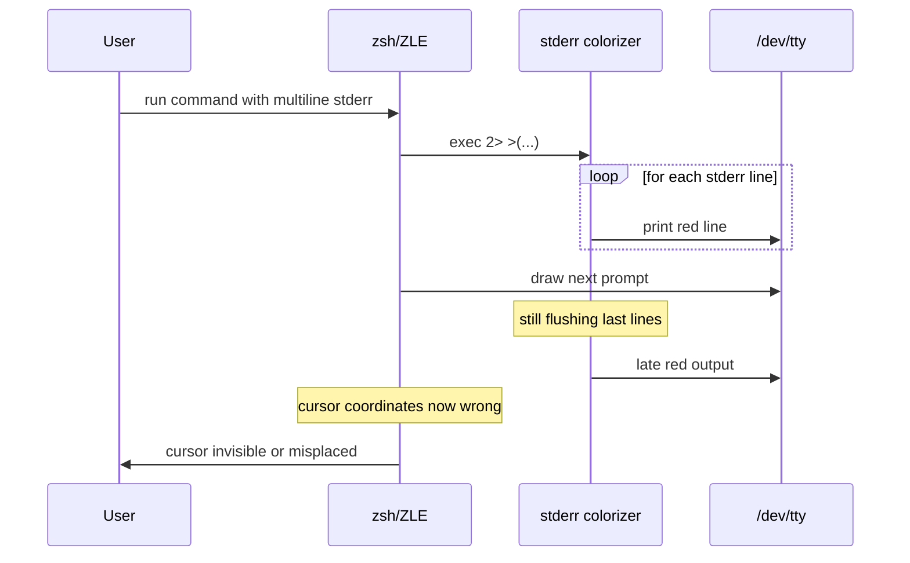

# fix(zsh,wezterm): replace racy stderr colorizer with synchronous replay

## Problem

In WezTerm + zsh, the text cursor sometimes disappears after commands that produce multiline stderr output. The terminal continues to accept input and scroll normally, but the cursor becomes invisible until the pane/tab is recreated.

## Root cause

The dotfiles implement a shell-level stderr colorizer in `config/zsh/.zshrc`, enabled by the environment variable `WEZTERM_DISCRIMINATE_STDERR=1` set in `config/wezterm/.wezterm.lua`:

```zsh
exec 2> >(
  while IFS= read -r line; do
    command printf '\033[91m%s\033[0m\n' "$line"
  done
  ...
)
```

This redirects the shell's stderr into an asynchronous zsh process-substitution coprocess. After a command finishes, zsh/ZLE draws the next prompt immediately, while the colorizer may still be flushing the last lines of red stderr. On multiline stderr this race is much more likely to occur.

When the colorizer writes after the prompt has been drawn, ZLE's internal cursor coordinates become desynchronized. The cursor may be placed off-screen, overwritten, or left hidden if a cursor-hide escape sequence (`\033[?25l`) leaked through stderr without a matching show-cursor escape (`\033[?25h`).

This is a fundamental limitation of `exec 2> >(...)`: stderr and stdout are no longer byte-synchronized, and the colorizer shares the controlling tty with ZLE.



## Proposed fix

Replace the process-substitution colorizer with a synchronous, race-free approach:

1. In `preexec`, redirect the command's stderr to a secure temp file.
2. In `precmd`, restore stderr to the terminal and replay the captured lines in bright red before the next prompt is drawn.
3. Skip known interactive commands (sudo, ssh, vim, less, tmux, etc.) so their stderr stays a real tty.

This sacrifices byte-perfect stdout/stderr interleaving — stderr appears as a block after the command finishes — but it preserves multiline stderr, keeps the output red, and eliminates the cursor race. The user explicitly said they are fine with seeing stderr distinctly rather than requiring real-time interleaving.

## Files changed

1. `config/zsh/.zshrc`
   - Replace the `_wezterm_stderr_enable` / `_wezterm_stderr_disable` process-substitution block with `_wezterm_stderr_preexec` / `_wezterm_stderr_precmd` / `_wezterm_stderr_zshexit`.
   - Add a skip-list for interactive commands that need direct stderr/terminal access.
   - Keep the `WEZTERM_DISCRIMINATE_STDERR` toggle behavior unchanged.

2. `config/wezterm/.wezterm.lua`
   - Update the stderr-discrimination comment to describe the new synchronous capture/replay behavior.
   - Keep `WEZTERM_DISCRIMINATE_STDERR = '1'` so the zsh block is still enabled.

3. `AGENTS.md`
   - Update the descriptions of `config/zsh/.zshrc` and `config/wezterm/.wezterm.lua` to describe the new stderr capture behavior.

4. `README.md`
   - Add a note about WezTerm stderr capture to the Notes section.

5. `Makefile`
   - Fix `reload-zsh` to use `zsh -c "source $(HOME)/.zshrc"` instead of the bare `source` builtin, which fails under `/bin/sh`.

## New zsh implementation

```zsh
# Color stderr red in WezTerm.
# WezTerm cannot distinguish stdout from stderr at the terminal level, so we
# capture stderr to a temp file while a command runs and replay it in red
# synchronously before the next prompt is drawn. This avoids the cursor-
# disappearing race caused by the previous process-substitution approach.
if [[ $TERM_PROGRAM == "WezTerm" && -n "$WEZTERM_DISCRIMINATE_STDERR" ]]; then
  # Secure temp file for captured stderr.
  _wezterm_stderr_file=$(command mktemp "${TMPDIR:-/tmp}/wezterm_stderr.XXXXXX")
  command chmod 600 "$_wezterm_stderr_file"

  # Save the shell's original stderr fd so we can always restore it.
  exec {_wezterm_stderr_orig}>&2

  _wezterm_stderr_preexec() {
    local cmd="$1"
    local first="${cmd%% *}"
    first="${first##*/}"  # basename of first word

    # Skip background jobs: the shell returns immediately, so we would race
    # with the still-running job writing to the temp file.
    local trimmed="${cmd%"${cmd##*[![:space:]]}"}"
    [[ "${trimmed: -1}" == "&" ]] && { _wezterm_stderr_skip=1; return; }

    # Skip commands that need direct stderr/terminal access, replace the
    # shell, or detach/redirect stderr themselves.
    # Extend this list as needed for your workflow.
    case "$first" in
      sudo|su|doas|nohup|ssh|scp|sftp|rsync|\
      vim|nvim|vi|emacs|nano|micro|\
      less|more|most|man|tailf|watch|\
      htop|top|btm|glances|tmux|screen|\
      fzf|zsh|bash|exec)
        _wezterm_stderr_skip=1
        return
        ;;
    esac

    _wezterm_stderr_skip=0
    : >| "$_wezterm_stderr_file"
    exec 2>"$_wezterm_stderr_file"
  }

  _wezterm_stderr_precmd() {
    # If the last command was skipped, stderr is already on the terminal.
    (( _wezterm_stderr_skip )) && { _wezterm_stderr_skip=0; return; }

    # Restore stderr BEFORE replaying, so output goes to the right place.
    exec 2>&${_wezterm_stderr_orig}

    if [[ -s "$_wezterm_stderr_file" ]]; then
      local line
      while IFS= read -r line || [[ -n "$line" ]]; do
        command printf '\033[91m%s\033[0m\n' "$line"
      done < "$_wezterm_stderr_file"
      : >| "$_wezterm_stderr_file"

      # Safety net: ensure the cursor is visible if stderr carried a
      # cursor-hide escape sequence. Kept inside this block so it does not
      # emit output when there is no stderr; an unconditional printf here
      # triggers Powerlevel10k's instant-prompt warning on the first prompt.
      command printf '\033[?25h'
    fi
  }

  _wezterm_stderr_zshexit() {
    [[ -n "$_wezterm_stderr_file" ]] && command rm -f "$_wezterm_stderr_file"
  }

  preexec_functions+=(_wezterm_stderr_preexec)
  precmd_functions+=(_wezterm_stderr_precmd)
  zshexit_functions+=(_wezterm_stderr_zshexit)
fi
```

## Testing

1. Run the validation script:
   ```sh
   scripts/validate.sh
   ```
   Lua validation may be skipped if `luac` is not installed; that is expected on this machine.

2. Apply the updated configs:
   ```sh
   make copy-zsh copy-wezterm
   make reload-zsh
   ```
   `make reload-zsh` sources `.zshrc` in a subshell; to test in the current pane either open a new WezTerm tab or run `source ~/.zshrc` in your current shell.

3. In WezTerm, run commands that produce multiline stderr:
   ```sh
   for i in {1..20}; do echo "error $i" >&2; done
   ```
   The cursor should remain visible after the prompt returns, and the errors should appear in red.

4. Verify interactive programs are not broken:
   ```sh
   sudo true
   man ls
   vim
   ```
   These should behave normally because they are in the skip list.

5. Verify normal stdout still prints in real time:
   ```sh
   for i in {1..5}; do echo "out $i"; sleep 1; done
   ```
   Stdout should appear line-by-line, not buffered until the end.

## Alternatives considered

- **Keep the process-substitution colorizer and only add `\033[?25h` in `precmd`.** This masks the symptom but does not fix the underlying race; prompt corruption and misplaced cursors can still occur.
- **Use `stderred` (DYLD_INSERT_LIBRARIES).** This is the most robust real-time stderr colorizer, but it is not in Homebrew core, must be built from source/`--HEAD`, and is ignored by SIP-protected macOS binaries and hardened-runtime apps. It is a viable future alternative if real-time interleaving is required.
- **Use a named FIFO instead of process substitution.** The same tty race remains because the colorizer still writes concurrently with ZLE.
- **Remove stderr coloring entirely.** This is the simplest fix and eliminates the root cause, but the user prefers to keep stderr visible/distinct.

## Notes

- Stdout and stderr are no longer interleaved byte-by-byte. If a command writes to both streams, all stdout appears as emitted, then all captured stderr is replayed in red before the next prompt.
- The skip list is a heuristic. If an interactive command misbehaves, add its first word to the `case` statement.
- No new Makefile target is required because the change only modifies existing config files.
